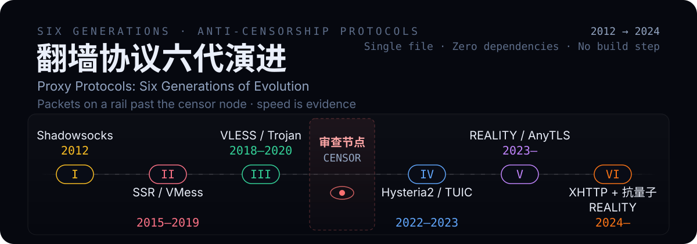
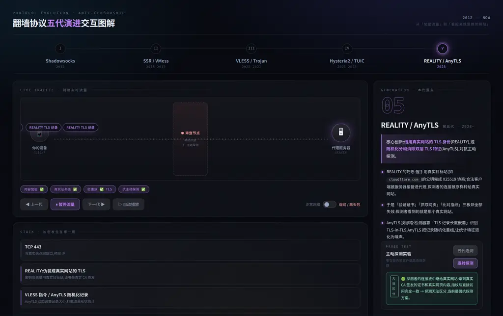
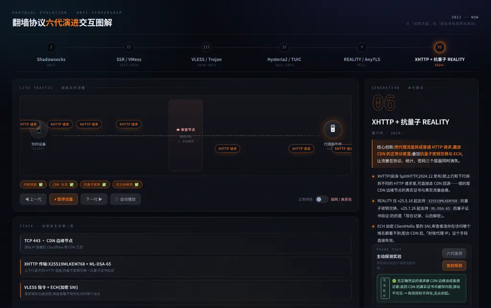

# 翻墙协议六代演进 · 交互图解

**English** | [简体中文](./README.md)

> 从 Shadowsocks 到 XHTTP:六代抗审查协议的演进,做成一个可以玩的页面。

**[▶ 在线演示](https://alloevil.github.io/proxy-evolution/)** · 单文件 · 零依赖 · 无需构建

<p align="center">
  
</p>



<details>
<summary>▲ 主界面:数据包以各代协议的真实速度流经「审查节点」</summary>

点击「发射探测」会触发**主动探测剧场**——第六代把无凭证的请求交给 CDN 边缘,审查者拿到 CDN 的真实证书与缓存内容,连源站都看不到:



</details>

---

## 这是什么

一张页面讲清楚:为什么第一代代理会被识别,而第六代能让主动探测者「看到一个正常的网站,且那个网站根本不是你的服务器」。

抽象的协议对抗被具象化为三件事:

| 具象 | 对应的真实机制 |
|---|---|
| **数据包在轨道上流动** | 各代协议的真实速度差异、弱网下的重传与队头阻塞 |
| **审查节点卡在链路中间** | 被动识别(统计分类)+ 主动探测(伪装客户端直连) |
| **探测包飞向服务器** | 审查者拿到什么响应 —— 决定一个协议的生死 |

## 六代演进

```
第一代  Shadowsocks (2012)            把 SOCKS5 明文转发改为对称加密转发(不模拟真实协议外形)
   ↓
第二代  SSR / VMess (2015)            增加混淆和防重放
   ↓
第三代  VLESS (2020) / Trojan (2018)         加密交给外层 TLS;Trojan 回落到预设站点(常配成真实 HTTPS 站)
   ↓
第四代  Hysteria2 / TUIC (2022–2023)       基于 QUIC,弱网/高延迟下速度碾压 TCP 系
   ↓
第五代  REALITY (2023) / AnyTLS (2025)       借用真实网站的 TLS 身份,对抗主动探测
   ↓
第六代  XHTTP + 抗量子 REALITY (2024) 拆成普通 HTTP 请求藏进 CDN;抗量子密钥 + ECH
```

## 交互功能

### 实时流量动画
数据包持续流经「审查节点」。**速度即证据**:SS 80px/s、QUIC 95px/s、弱网下 TCP 系腰斩并出现 `⚠ 重传` 标记,而 QUIC 反而加速 —— Brutal 拥塞控制不因丢包退让,而是按设定带宽略微超发补偿(仅在配置了带宽时启用)。打开「弱网」开关,差异肉眼可见。

### 主动探测实验
点击「发射探测」,观察审查者伪装成客户端直连服务器能拿到什么响应。判定分三档:

- 🔴 **可被识别** —— 返回无语义加密乱码,无网站结构
- 🟡 **部分暴露** —— 有 TLS,但证书/指纹可被比对
- 🟢 **无法区分** —— 审查者拿到的就是一个真实网站

REALITY 一代有专属剧场:探测包被转发到真实网站节点,返回「真实网站证书」。这正是它抗探测的原理。

### 六代连测
一键依次探测六代,把六种判定串成一条演进线,看清「抗主动探测」是如何一步步做到的。

### 审查环境剧本
四个罐装攻击序列,自动播放并实时推进剧情:

| 剧本 | 剧情 | 结局 |
|---|---|---|
| 主动探测攻击 | 审查者逐代直连,比对证书与内容 | 前四代 🔴/🟡,REALITY 与 XHTTP 🟢 |
| 深度包检测 | 分类器扫包长熵/时序/TLS 指纹(JA3/JA4,仅对含 ClientHello 的流量) | SS/SSR 🔴,真 TLS + ECH/CDN 让检测目标消失 |
| UDP 封锁 | udp/443 限速 50kbps | Hysteria2 被限速/封锁 → 客户端切到 REALITY/XHTTP(TCP)节点恢复(手动/回落配置,非协议自动降级) |
| 弱网远距离 | RTT 300ms + 8% 丢包 | TCP 系崩塌,QUIC 几乎不受影响 |

### 协议栈面板
标注每一代「加密发生在哪一层」—— 直观看懂第三代把加密上移到 TLS、第五代借真实网站背书身份、第六代把身份藏进 CDN。

### 对比区
四维指标(峰值速度 / 弱网表现 / 抗主动探测 / 伪装真实度),行悬停整行提亮并露出分值,点击行头按该指标重排世代(FLIP 滑动动画)。

## 快速开始

```bash
# 方式一:直接打开
open index.html            # macOS
xdg-open index.html        # Linux
start index.html           # Windows

# 方式二:本地起服务
python3 -m http.server 8000
# → http://localhost:8000

# 方式三:部署到 GitHub Pages
# 本仓库已开启 Pages(Settings → Pages → main 分支),push 即自动部署
```

## 操作

| 操作 | 方式 |
|---|---|
| 切换世代 | 点顶部世代卡片 · `←` `→` |
| 暂停/继续流量 | `Space` |
| 深链分享 | URL hash,如 `#reality`、`#xhttp` |
| 自动播放 | 「▷ 自动播放」,适合演示 |

## 技术

- **单文件** `index.html`,原生 JS + CSS,零依赖、零构建、可离线使用
- **动画引擎**:`requestAnimationFrame` + 看门狗(rAF 循环意外中断 1s 内自愈)、tick 体 try/catch 防单帧异常杀死循环
- **视觉**:玻璃拟态 + mesh 渐变 + 噪点颗粒;每代主色驱动全站 CSS 变量;切代 crossfade、对比区 FLIP 动画(Web Animations API)
- **数据驱动**:六代协议全部参数(速度、丢包率、弱网倍率、探测判定、剧本步骤)集中在一处 `GENS` / `PRESETS` 数组,便于增补新协议

## Agent / 机器可读

| 端点 | 用途 |
|---|---|
| [`data.json`](https://alloevil.github.io/proxy-evolution/data.json) | 完整数据集:六代协议(协议栈、徽章、讲解要点、动画参数、探测判定、对比分值)+ 四个剧本的分步事件。含 `innovationText` / `pointsText` / `probeText` 等**去 HTML 纯文本字段**,LLM 可直接引用 |
| [`llms.txt`](https://alloevil.github.io/proxy-evolution/llms.txt) | 面向 LLM 的摘要:六代演进、关键概念、参数对照表、剧本结局表 |
| `robots.txt` | 显式放行 GPTBot / ClaudeBot / PerplexityBot / Google-Extended / Bytespider / CCBot |

`data.json` 由 `build-data.py` 从 `index.html` 内嵌的 `GENS` / `PRESETS` 数组生成(HTML 是单一事实来源,JSON 不会漂移):

```bash
python3 build-data.py    # 修改 index.html 数据后重新生成 data.json
```

## 说明与免责

- 机制层断言(各代协议「做了什么」)已于 2026-09-11 对照一手来源逐条核实:Shadowsocks 规范(sip004 / sip022)、SSR 与 VMess 源码及文档、Trojan 协议文档、Xray-core(VLESS / REALITY / XHTTP 及其发布说明)、XTLS/REALITY、anytls-go、Hysteria、TUIC、RFC 9000。本轮修正了:REALITY 握手密钥来源(服务器自身密钥对,不是目标站公钥)、Trojan 回落语义(预设端点,非「真实网站」)、JA3/JA4 的归属(ClientHello 指纹,不是证书)、QUIC 队头阻塞的粒度(按流而非按包)、Brutal 语义(按设定带宽略超发,仅在配置带宽时启用)、AnyTLS 年代(2025,不是 2023)、VLESS/Trojan/Hysteria2/TUIC 的年份,以及 SS 条目的时代错位(2012 原版是流密码,AEAD 与重放防护分别在 2017 / 2022 才加入)、SS「伪装成普通加密流量」的表述(规范里 SS 不模拟任何协议外形,只是加密转发)。Shadowsocks 的 2012 起始年份属社区记载(PyPI 最早发布 2013-06、GitHub tag 最早 2015),本页沿用社区通行的 2012。
- 对比区各项分值为**相对示意值**,用于建立直觉,非基准测试数据。
- 弱网表现基于各协议的拥塞控制与传输层差异:TCP(TLS 系)丢包时整条连接队头阻塞、退避重传;QUIC(Hysteria2 / TUIC)在 UDP 上按流独立重传,Hysteria2 的 Brutal 拥塞控制不因丢包降速(按设定带宽略微超发补偿)。
- 四个剧本的结局同为示意,不构成对任何协议在真实审查环境下的成败承诺。
- 「抗主动探测」指服务器被直连时能否返回与真实网站完全一致的响应。
- 本项目仅用于技术原理学习与研究。

## License

[MIT](./LICENSE)
